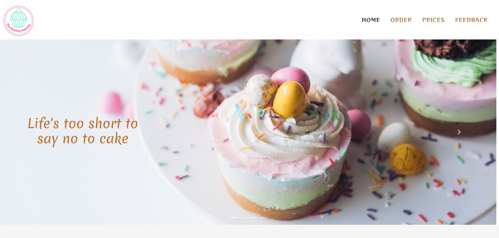

 
    
    <h2>
        The Baking Mommy is a website for the cake lovers. All cake lovers should be able to order the cakes they like and give feedback
    </h2>
    <h3><a href="https://murthy1811.github.io/The-Baking-Mommy_MS2/" target="_blank">Click here</a> to view the site on GitHub pages.</h3>

## Table of Contents

1. [**Overview**](#overview)
2. [**User Experience**](#user-experience)
    - [**User Stories**](#user-stories)
    - [**Wireframes**](#wireframes)
    - [**Design**](#design)
3. [**Features**](#features)
    - [**Existing Features**](#existing-features)
    - [**Homepage Features**](#homepage-features)
    - [**Orderpage Features**](#orderpage-features)
    - [**Pricespage Features**](#pricespage-features)
    - [**Feedbackpage Features**](#feedbackpage-features)
    - [**Future Features**](#future-features)
4. [**Technologies Used**](#technologies-used)
5. [**Testing**](#testing)
6. [**Deployment**](#deployment)
    - [**Deploying to GitHub Pages**](#deploying-to-github-pages)
    - [**Forking the GitHub Repository**](#forking-the-github-repository)
    - [**Cloning the GitHub Repository**](#cloning-the-github-repository)
7. [**Credits**](#credits)
8. [**Acknowledgements**](#acknowledgements)

## Overview

The fundamental objective of this website is to facilitate the user to go through the cakes available. User should be able to select a cake , make an order. Also, User 
should be able to give feedback on the cake, and overall experience.

Business Goals

  - Create an attractive website for selling cakes

    - Website welcomes the user with beautiful cakes and attract visually ,therefore bringing out the happy memories associated with cakes and 
      there by encouraging user to buy a cake for his needs.

  - Provide a hassle free ordering experience

    - Easy selection of cake assortments by interacting with the options and make an order with simple details filled in.
      Clear information provided for the next steps , by reaching the user to agree on the order by both parties, and information on delivery times and areas. 
      All the forms filled in should be able to give the confirmation to the user, if its a success or error.

  - Encourage user to travel and be a part of the organisation's future

    - Providing the user a chance to subscribe for offers, and recipes to try out at home. Reach user through email. Facilitate the user to give the feedback
      on the cake taste and Quality and over all experience. Make a simple star rating to provide feedback.

Customer goals

  - An interactive website to buy cakes for the special occasions or in general

    - Selection of cakes , or a mix of cakes available give user a chance to buy what one wants. 

  - An easy to navigate website, especially important for older age group users

    - The website consists of four pages clearly distinguished by the names, Home, order, prices and feedback. The respective names are self explanatory. Home 
    page provides information on cakes available with eye pleasing images to attract. Order page lets user to select cakes and make an order, and also gives clear information
    on how the organisation reaches user for agreement and delivery. Prices page gives the costs of cakes, and how the payment should be made. Feedback page lets user to give 
    ratings on his overall experience. Footer content gives away social media links, contact and a little detail of the organisation.
    

 ## User Experience

- ### User Stories

    As an User, I want:
 
    1. Find information on the type of cakes available
    2. Understand or read the other users experience with the cake
    3. Easily make an order for an interested cake
    4. Get confirmation once I make an order or give feedback
    5. Clear information on delivery areas and time.
    6. Check out the social media of the organisation and can reach them through it
    7. Associate with the organisation to make future purchases.
    8. Get the details of the prices.
    9. Give proper feedback in different categories and overall experience.

- ### Wireframes

    [Index page Mobile wireframe](https://github.com/murthy1811/The-Baking-Mommy_MS2/blob/master/assets/images/wireframes/index-mobile.jpg)

    [Index page Desktop wireframe](https://github.com/murthy1811/The-Baking-Mommy_MS2/blob/master/assets/images/wireframes/index-desktop.jpg)

    [Index page Tablet wireframe](https://github.com/murthy1811/The-Baking-Mommy_MS2/blob/master/assets/images/wireframes/index-tablet.jpg)

    [Order page Mobile wireframe](https://github.com/murthy1811/The-Baking-Mommy_MS2/blob/master/assets/images/wireframes/order-mobile.jpg)

    [Order page Desktop wireframe](https://github.com/murthy1811/The-Baking-Mommy_MS2/blob/master/assets/images/wireframes/order-desktop.jpg)

    [Order page Tablet wireframe](https://github.com/murthy1811/The-Baking-Mommy_MS2/blob/master/assets/images/wireframes/order-tablet.jpg)

    [Prices page Mobile wireframe](https://github.com/murthy1811/The-Baking-Mommy_MS2/blob/master/assets/images/wireframes/prices-mobile.jpg)

    [Prices page Desktop wireframe](https://github.com/murthy1811/The-Baking-Mommy_MS2/blob/master/assets/images/wireframes/prices-desktop.jpg)

    [Prices page Tablet wireframe](https://github.com/murthy1811/The-Baking-Mommy_MS2/blob/master/assets/images/wireframes/prices-tablet.jpg)

    [Feedback page Mobile wireframe](https://github.com/murthy1811/The-Baking-Mommy_MS2/blob/master/assets/images/wireframes/feedback-mobile.jpg)

    [Feedback page Desktop wireframe](https://github.com/murthy1811/The-Baking-Mommy_MS2/blob/master/assets/images/wireframes/feedback-desktop.jpg)

    [Feedback Tablet wireframe](https://github.com/murthy1811/The-Baking-Mommy_MS2/blob/master/assets/images/wireframes/feedback-tablet.jpg)

Deviations from the wireframes

  - On the home page, It is decided to change the pattern of the images , add buttons to showcase the assortment with some javascript.
  otherwise, not much changes are made from wireframes.

- ### Design

  - #### Colour Scheme

   I took help from  https://coolors.co/palettes/trending to decide to color palettes
  I decided to go for a little funky and bold colors , as it should invoke the feeling of fun and party in user. I choose #bc6c25 , a layer of brown, for the main text and content.
  I kept buttons with basic white text and a background of #17a2b8. I chose footer to be with black background with text in rgb(241, 176, 129), so as to show clear deviation from the 
  main page 

  - #### Typography

    [Reggae One](https://fonts.googleapis.com/css2?family=Merienda&family=Reggae+One&display=swap) was chosen as the main font for this website with sans-serif as the fallback font.
    Reggae One is little funky to appeal to the fun aspect of an user. Another funky and stylish font Merienda is used to distinguish soome text from others.

## Features

### Existing Features

- ### Homepage Features

   1. Navigation bar with indication of which page user is on. Toggle icon for navigation menu for the small screen users.
   2. Image carousel is implemented , with images moving with few cake quotes, encouraging user to buy cakes.
   3. Buttons to interact to view the cakes assortment available for sale.
   4. user stories for the user affirmation

- ### Orderpage Features

   1. User should be able to select if he/her needs fruit cake, cream cake with a theme. User can mix the options, and make an order or write completely new cake in the form
      A clear text informs the user that they will be reached once the order is made to agree on everything. With selection buttons, text and order form will be automatically 
      filled to let user know which cake they selected. selection input for cakes will be activated only with clicking select buttons.
   2. Google Maps API is called to indicate the locations, where the cakes will be delivered.Time and delivery fee are mentioned in text.
   3. Order form is prefilled with cake selection or user can make a new text. User should fill in mandatory details for the order submit button to get activated.
   4. Upon submission, either a success or error sweet alert is given for user confirmation
   5. Email feature is built to receive for the organisation to check when a new order is made.

- ### Pricespage Features

    1. Prices are mentioned clearly for the type and weight of cakes.
    2. User is encouraged to subscribe for the offers and recipes , so as to keep in touch with organisation. confirmation is provided upon subscription.

- ### Feedbackpage Features

    1. User will be guided clearly to select the needed options, by showing the answers in red and upon responding, the answers turn to green.
    2. Rating is asked to given on a scale of 1 to 5 with radio buttons.
    3. Text box is provided for any additional comments for the free user input.
    4. A clear star rating input is given for providing satisfaction to the user
    5. Submit button is activated only after everything is filled except the additional text.
    6. Confirmation is provided to the user upon successful feedback.
    7. Email feature is built to receive for the organisation to check when a new feedback is given.

### Future Features
 
The following are elements that could be added to the website in future development:

- A payment page to go to , after the order is submitted.

- Response email to the user confirming the order they just made.

- An SMS alert to user's mobile once the order is done.

- A live box showcasing the instagram, twitter comments from the various users.

## Technologies Used

- HTML5
- CSS3
- Javascript
- Bootstrap v4.3.1
- Google Chrome Dev tools for debugging
- Google Light house for audits
- [JQuery](https://jquery.com) The project uses **JQuery** to simplify DOM manipulation.
- EmailJS
- Sweetalert2 Github

## Testing 

The testing data for this project can be found in a separate file called [TESTING.md](https://github.com/murthy1811/The-Baking-Mommy_MS2/blob/master/TESTING.md).

## Deployment 

### Deploying to GitHub Pages

This project was deployed to GitHub Pages using the following process:

1. Log in to GitHub and locate the projects [repository](https://github.com/murthy1811/The-Baking-Mommy_MS2).
2. From the menu locate and click Settings.
3. Scroll down to the GitHub Pages section.
4. Click on the drop-down menu under Source and select Master Branch.
5. Click the Save button.
6. The site is now published and the [link](https://murthy1811.github.io/The-Baking-Mommy_MS2/) is provided.

### Forking the GitHub Repository

Forking a repository allows you to freely experiment with changes without affecting the original project.
This project can be forked using the following process:

1. Log in to GitHub and locate the projects [repository](https://github.com/murthy1811/The-Baking-Mommy_MS2).
2. At the top right-hand side of the page locate and click on the Fork button.
3. Further information can be found [here](https://docs.github.com/en/free-pro-team@latest/github/getting-started-with-github/fork-a-repo).

### Cloning the GitHub Repository

1. Log in to GitHub and locate the projects [repository](https://github.com/murthy1811/The-Baking-Mommy_MS2).
2. Click on the Code button which is located above the list of project files.
3. Copy the URL link located under the HTTPS tab.
4. Open a terminal in your IDE.
5. Change the current working directory to the location where you want the cloned directory.
6. Type `git clone`, and paste the URL you copied in Step 3.
7. Press Enter to create your local clone.
8. Further information can be found [here](https://docs.github.com/en/free-pro-team@latest/github/creating-cloning-and-archiving-repositories/cloning-a-repository).

### Using your own Google maps API key

Since the API key is restricted to work only the url's I added in my account, google maps function will not work. 
    You should create your own account in google cloud platform and get the key for maps API. check out the site for instructions [here] (https://developers.google.com/maps/documentation/maps-static/get-api-key)

Go to the order.html, go to the end of the code. Just before the body closing, look for script tag with maps.googleapis.com, and replace the existing key with your own.

### Using your own EmailJS

Create your own account in emailJS. Make sure you have the email service for example a, free service like gmail. 
Create a template with the variables needed, shown in the javascript "from_name","from_phone","cake","message","message2","address","reply_to" .
Get your own template id, and service id. Copy it in the below javascript line in order.js
emailjs.send("service_xkqr1dk", "template_m0virhs")

## Credits

- Main logo is made in www.freelogodesign.org. Used the templates available in it

- Image Credits
    - Carousel images
        - pic1 Photo by Melissa Walker Horn on Unsplash 
        - pic2 Photo by David Holifield on Unsplash
        - pic3 Photo by ROMAN ODINTSOV from Pexels
        - pic4 Photo by Hayley Maxwell on Unsplash
 
    - Assortment pictures on Main page
        - infopic1 Photo by Valeria Boltneva from Pexels  
        - infopic2 Photo by Kristina Paukshtite from Pexels  
        - infopic3 Photo by Vlada Karpovich from Pexels 

    - Select/unselect images on order pages

        - selectpic1 Photo by Diana Akhmetianova on Unsplash  selectpic1 
        - selectpic2 Photo by Estefanía Escalante Fernández on Unsplash 
        - selectpic3 Photo by Wedding Dreamz on Unsplash

    - Order form background image

        - formpic1 - Photo by Deva Williamson on Unsplash 

    - User pics in index page are from family and friends. Used with their permission.
   
- Fontawesome was used for the favicions throughout the page.

    https://fontawesome.com/

- Bootstrap is used for carousel images, navbar toggle icon, , user reviews, feedback questionaire for turning red to green. 

- https://stackoverflow.com/ is very helpful in answering various questions popped up while making the code. Code adapted from the commments by various users.
  some of the users were given credit below although the code is not exactly taken.

   - select/unselect javascript in order page – user Aashish 
   - subscribe button disable/able in prices page - user Erik Palakovich

- While sweetalert is being Implemented, some code is adapated from the website https://code.tutsplus.com/tutorials/creating-pretty-popup-messages-using-sweetalert2--cms-30662

- While the error - sweetalert function works eevn when the form is not filled, is being fixed, code from the user comments on the site
   https://joomla.stackexchange.com/questions/4614/make-submit-button-inactive-until-fields-have-been-filled  answer by user johanpw

- Star rating on the feedback page idea and code is adapted from https://www.markuptag.com/feedback-form-with-star-rating-html/

- EmailJS library is used for emailing on order form and feedback form

- https://css-tricks.com/ is helpful in figuring out styling issues.

- Original wireframes were created with https://www.figma.com/wireframe-tool/

- Readme document is heavily influenced from Code institute guidance as well as Johnny Morgan MS2 submission.

## Acknowledgements

- I would like to Acknowledge Excellence Ilesanmi for his review on the project and giving feedback and changes to be made.
- Tutor support

**This project is for educational use only and was created for the Code Institute Module of interactive front end development**

**Created by Murthy Valavala**