# Testing

## Table of Contents

1. [**Testing Overview**](#testing-overview)
2. [**Validation**](#validation)
    - [**W3C Markup Validator results**](#w3c-markup-validator-results)
    - [**W3C CSS Validator results**](#w3c-css-validator-results)
    - [**JSHint Validation results**](#jshint-validation-results)
3. [**Testing User Stories from User Experience Section**](#testing-user-stories-from-user-experience-section)
4. [**Manual Testing on Live Site**](#manual-testing-on-live-site)
5. [**Bugs Discovered**](#bugs-discovered)
6. [**Website Performance**](#Performance-report-dev-tools)

## Testing Overview

- The website was tested on Google Chrome, Mozilla Firefox, Opera, Safari and Microsoft Edge browsers.

- Using Chrome developer tools the responsive nature of the site was tested on the Moto G4, Galaxy S5, iPhone5/SE, iPhone 6/7/8, iPad, iPad Pro and Surface Duo.

- The website was tested on real-life devices, namely a 14" Windows laptop, an Galaxy Android Phone and an iPhone SE.

## Validation

- The [W3C Markup Validator](https://validator.w3.org/#validate_by_input) service was used to validate the HTML code of the project.
  
- The [W3C CSS Validator](https://jigsaw.w3.org/css-validator/#validate_by_input) service was used to validate the CSS code. No errors were found.

- [JSHint](https://jshint.com/) was used to validate the JavaScript code of the project.

### W3C Markup Validator results

- index.html

    - Two minor errors were found. Alt attribute is missed in images for user stories. This is added. One warning is found, which is article tag is missing the heading. I removed the article
      tag which I thought is unneccesary in the first place.

- order.html

    - A minor error is found for selection images, height and width are added in html with px. This is removed after check. Minor warnings were fixed.

- prices.html

    - Minor Error- section tag is not closed . This is fixed now.

- feedback.html

    - Minor Error- extra form closing tag is found . This is fixed now.

### W3C CSS Validator results 

- The CSS passed with no errors.

### JSHint Validation results

- index.js

    - One warning that semicolon is missing. No problem with running the file. Semicolon is added.
      undeclared variables with $ were found. I could not found a proper solution for this. Some sites suggested to use the proper version of jQuery 
      but since the site is working as I intend to, I did not fix this warning.

- order.js, prices.js

    - No major errors were found. Warnings were given that undeclared variables were found and suggested to use esversion 6 or esversion 8 in some cases. 
      site is running as intended and I could not fix this errors. In the future, I will check this to update.

- feedback.js

    - one warning of semicolon missing is fixed. Undefined variables could not be fixed. Unused variable found, but this funciton sendmail is used in
      html ( submit button) for contact form.

## Testing User Stories from User Experience Section

 As an User, I want:
 
1. Find information on the type of cakes available

      - users were welcomed to the website with carousel cake images, and immediately below, text is displayed "check out our assortment", which 
        should be enough to make user to scroll down a bit . Images were displayed to identify with the cakes, and buttons were provided with a click icon, and
        encouraging test is written on the button to make user to click. Upon, click, cake list is displayed

        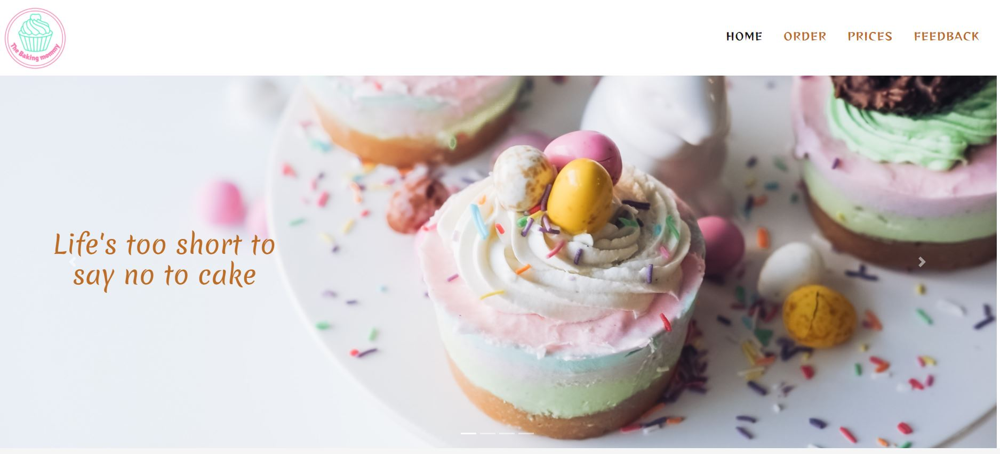
        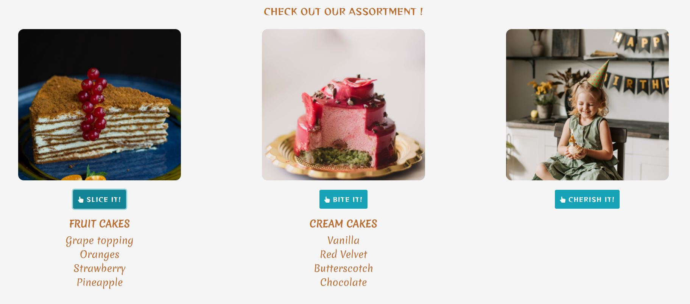

2. Understand or read the other users experience with the cake
- Immediately after cake assortment list, user reviews were given , to let the new user know about the taste of products and service of the organisation.
    
3. Easily make an order for an interested cake

 - Navigation bar clearly shows a separate page to make an order. 
Order page shows a form to the right, and on left, an options for user to select the cake. Buttons were consistent in all pages so as to make user familiar to click.
Upon selection of cakes, Display text below changes with the options selected by the user. As well, the order form will be prefilled automatically, to help user.
Clear text is written in the top of page for user to either select or write his own flaovour, and he will be reached to confirm. 
Order form is basic to fill with the details to reach and deliver the cakes.

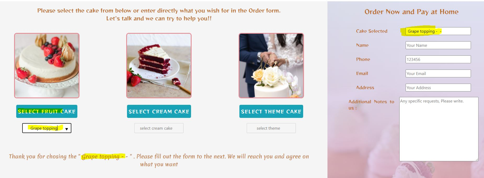

4. Get confirmation once I make an order or give feedback

- A sweet alert is given, once the order is submitted with a thank you and a confirmation message that the user will be contacted.
order submit is not activated untill all the required information is filled by the user , so that the order is reached with all details. 
 Error message will be given in case the order form is not submitted properly due to internet issues or any other.

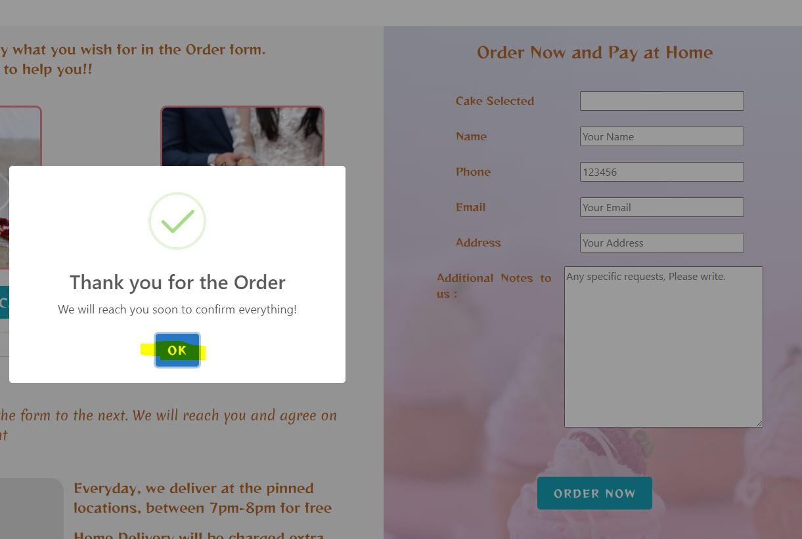
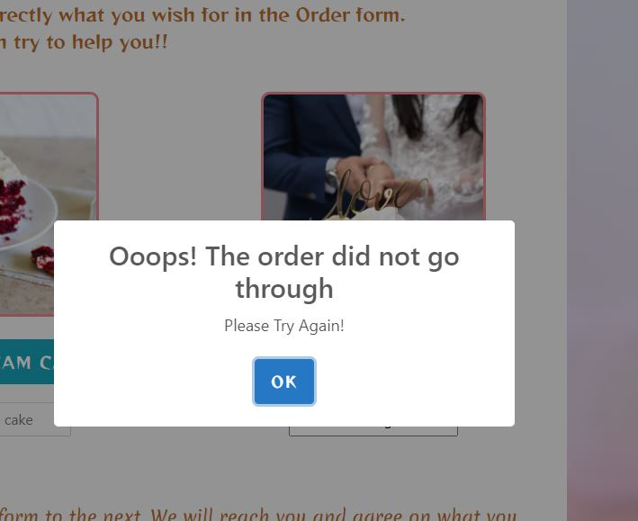

 

 5. Clear information on delivery areas and time.

 - Google maps API is called to show the user , locations where the cakes will be delivered, and the time is written clearly next to the maps.
 Delivery fee is mentioned for home deliveries. 

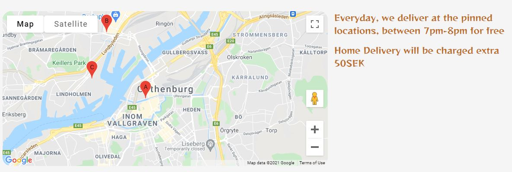

6. Check out the social media of the organisation and can reach them through it

   - Footer section is designed and is given in all pages. Social media links were given through font awsome icons and will be opened in a new page.
     Contact number and email were given in case an user wants to reach the organisation.

7. Associate with the organisation to make future purchases.

    - User is encouraged to make a subscription so that they can be reached via email with offers, recipes etc. User is asked to post their try-outs 
     in organisation instagram page. This is to keep relation with the user for all his future needs.

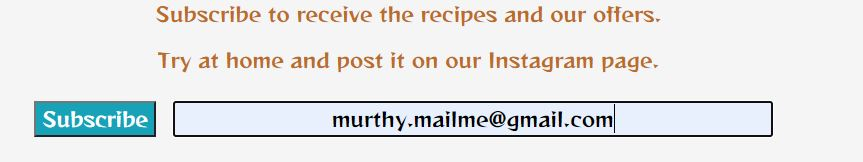

8. Get the details of the prices.

    - Prices page gives the user all costs of the cakes with a simple details.

9. Give proper feedback in different categories and overall experience.

    - feedback page is designed to guide the user. Submit button is disabled till the mandatory queries are answered. the queries were red in color before 
    user gives input. they will be turned to green once the user make a selection. Radio buttons were given in order to make the user job easy. Text box is provided in case , user wants 
to write feedback in detail, but not mandatory to fill , for the feedback submission. Form can be submitted with out this.
Finally, user is provided with star rating, to give the satisfaction for the user to be in charge. Sweet alert confimation is given to the user after the submission
   

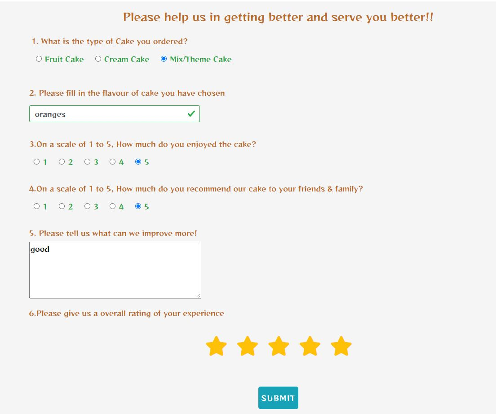

## Manual Testing on Live Site

- Home page

  1. Hovered over the icons to verify the hover colour change worked as expected.
  2. Clicked on the logo to check if the home page is loaded from all other pages.
  3. Checked if the images are sliding after couple of seconds automatically on all screens.
  4. Checked , on mobile, if the toggle icon is working fine
  5. Checked if the images can be moved by clicking on the side arrow area from both sides on all screens.
  6. Clicked on all the buttons to check if the cake list is being displayed and on all screens. verified if this text is toggling, by clicking again
  7. Checked if user stories are correctly displayed as intended. User images were avoided on small screens and this is working fine.
  8. checked all links on footer, to see if the socail media pages were opening on new tabs, on all screens.
  9. Clicked on phone icon in footer, to make sure it is going to make a phone call on mobiles and tabs.
  10. Clicked on email icon in footer, to make sure the email app is opening for sending an email.

- Order page

  1. Checked if the input box is getting activated and deactivated upon clicking the selection buttons on all screens.
  2. Verified if user can be able to pick the suggesitons in the input box.
  3. Verified if the display text is being changed, with the selections made by the user in the text box.
  4. verified if the Order form is being filled with the selection of cakes made by the user.
  5. verified if the selections are deselected, text and order form are automatically getting updated
  6. checked if the google maps is showing , on all screens, before deployment.
  7. Clicked on order form submit button with out filling the form, and filling one by one.
  8. checked if the confirmation message is displayed upon submission
  9. verified if email is being received upon the order submission.
  10. Verified, if there is prompt to fill in the rows, which were missed. Prompt is working.
  11. Veriifed, if error alert is displayed, in case of no internet and form is submitted.
  12. Checked by entering wrong email format, and text in place of number for phone information.

- Prices page
  
  1. checked if the price information is properly displayed on all screens.
  2. Clicked on subscribe button without entering an email
  3. checked if subscribe button is activated once the email is entered.
  4. Entered wrong email format to check if the subscribe button is getting activated.
  5. Entered email in correct format, and made sure the button is activated.
  6. Checked if the confirmation message is displayed, upon subscribing.

- Feedback page

  1. Checked if entire page is being displayed in good shape and readable on all screens
  2. Clicked on submit button without filling in any details to see if prompt is working.
  3. Filled in each question once and clicked on submit button to see if it is activated.
  4. Checked if red question is turning into green upon filling each response.
  5. Verified if button is activated after all mandatory responses were made.
  6. verified if the star rating function is working fine.
  7. Verified if email is being received with all the information entered by user.
  8. Checked if confirmation message is being displayed after the submission.

  Development tools on the chrome page were used extensively to develop the webiste while coding is written. Consistely website is checked for 
  alignment, colors, fonts, and javascript error checking etc using devtools to make sure the code works before updating the IDE.

## Bugs Discovered

 - Bugs while code is worked out and fixed.

 -  Upon form submission, intially ,the sweet alert is displayed for a second and page is redirected to code institute page
      Fixed by deleting the action attribute in html, and using emailJS, email is sent. Form no longer redirects to code institute.

 - Initially, several bugs were found while writing code, like without filling the form, submit button is in action and sweet alert is displayed. 
    - Fix added in javascript by disabling the submit button, as soon as the page is loaded.

        $('#ordernow').prop('disabled', true);

 - Initially form is not reset after submission.
    - Fix added in javascript by calling the reset function.

         function (response) {
                console.log("SUCCESS", response);
                document.getElementById("orderform").reset();
            },

 - within feedback page, the radio buttons were misplaced , the input box is flowing out of the page, in small screens.
   - fixed with media queries, for smaller screens and medium screens. 

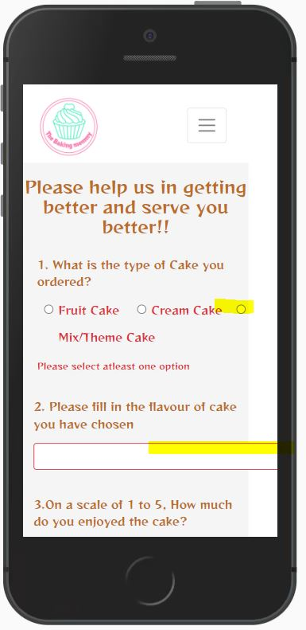

-  On home page, the buttons, were intially did not responded well on responsive screens. Text on buttons - cherish it, overflowed from the button 
   - fixed by setting the width option to automatically

- order form backgroound image is too bright and dominated the form
   - fixed by applying linear gradient to the image.

Bugs which were identified but not fixed due to time constraint, and lack of solutions

-  Order form - Additonal notes label and text box were not aligned with other inputs, on screens width from 1000px to 1400px.
    Fix need to be added in the future.

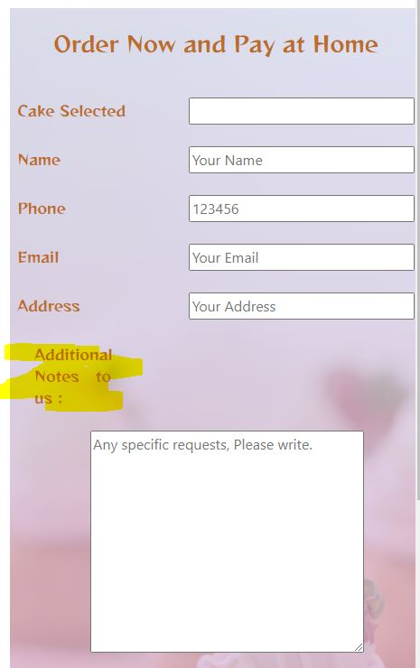

- For feedback form, there is no error alert message display in case submission is not made properly due to internet issues.
   Fix needed to be added in the future.

- On tablet screen, on home page, a cake quote on pic no.3 is not aligned.
   Fix needed to be added in the future.

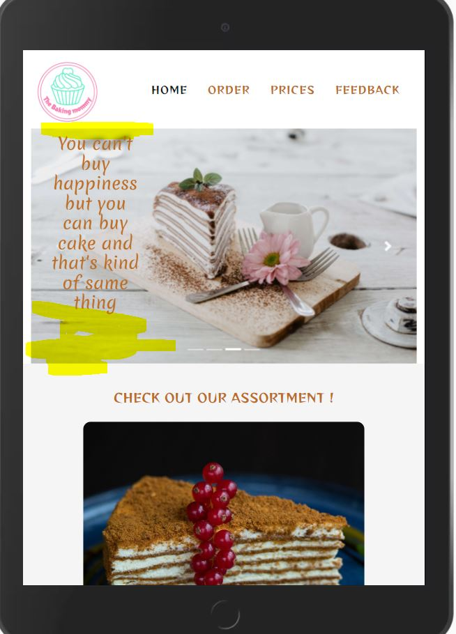

##Performance-report-dev-tools

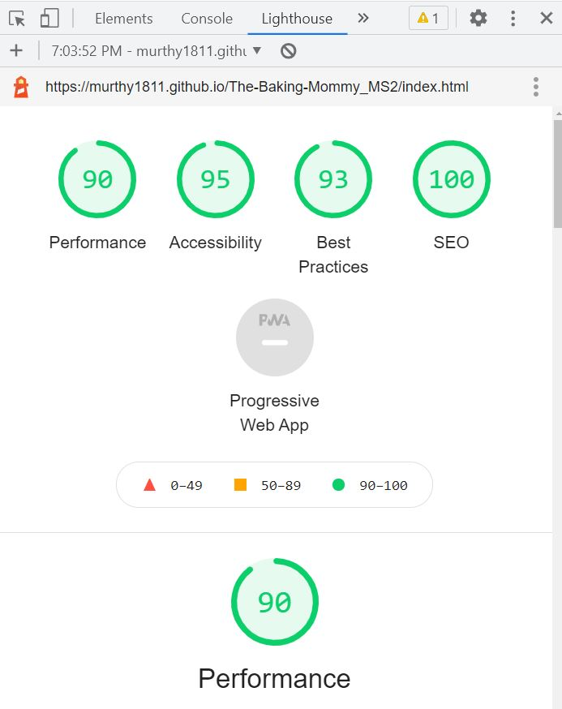

